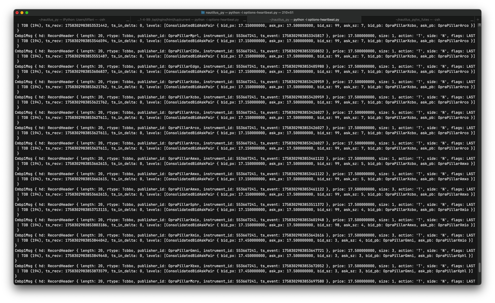
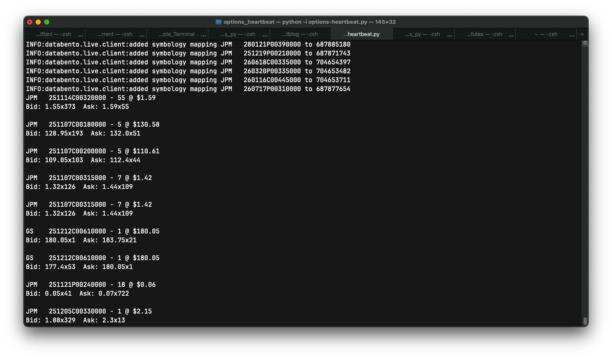

I trade options via Interactive Brokers and their [Trader Workstation](https://www.ibkrguides.com/traderworkstation/getting-started.htm) software. At a certain point, though, I 
realized their option chain interface did not always show the *true* last price a particular option traded at. Bid-ask
info would be updated continuously, but not necessarily last price. I was then potentially **getting a false sense of what was
actually happening at any given strike** and actually missing out on useful information. And the thing is, I pay for real-time data
from the exchanges via IBKR, so there was no good reason to be seeing stale price data.


I remembered that [Databento](https://www.databento.com) offers real-time OPRA data feeds, so I decided to sign up for
that. It's $199/mo, but I would argue it's been totally worth it to see options order flow in real-time all throughout
the trading day. You also get statistics about all the options you're interested in when the exchanges close for the day.


This code sample doesn't deviate much from the sample Databento offers to get you started with live data, but for a while this is what I used to watch real-time options order flow every weekday.
```{python}
#| eval: false

import databento as db

db.enable_logging("INFO")

symbols = ["GS    251219C00850000",]

live_client = db.Live(API_KEY)

live_client.subscribe(
    dataset = "OPRA.PILLAR",
    schema = "status",
    symbols = symbols,
    stype_in = "raw_symbol",
)

live_client.subscribe(
    dataset = "OPRA.PILLAR",
    schema = "tcbbo",
    symbols = symbols,
    stype_in = "raw_symbol",
)

live_client.subscribe(
    dataset = "OPRA.PILLAR",
    schema = "statistics",
    symbols = symbols,
    stype_in = "raw_symbol",
)

live_client.add_callback(print)
live_client.start()
```


This turned into:




Unfortunately, the raw output from the feed is very hard to read and follow what is happening with the options you're interested in.


In particular, the feed shows which option is which in the order flow via the `instrument_id`, but it's a number, not a somewhat human-readable identifier (with issuer, date, and strike such as `GS 251219C00850000`). Or even better, a *Goldman Sachs December 2025 850 call*. The feed gives you a listing of what `instrument_id` is tied to which option and strike, but that happens when the feed first launches. After that, there's no easy way to know what you're looking at. That calls for some modifications!


I cooked up something that makes order flow much more readable.


```{python}
#| eval: false

import os
import databento as db

# Prices don't come in 2-decimal form
OPT_PRICE_DIV = 1000000000

symbol_mappings = {}

def order_flow_print(order_flow_data):
    msg_type = type(order_flow_data)

    if(msg_type == db.SymbolMappingMsg):
        instrument_id = order_flow_data.instrument_id
        issuer_symbol = order_flow_data.stype_out_symbol
        symbol_mappings[instrument_id] = issuer_symbol
    elif(msg_type == db.CMBP1Msg):
        header = order_flow_data.hd
        instrument_id = header.instrument_id
        order_price = order_flow_data.price / OPT_PRICE_DIV
        order_size = order_flow_data.size
        symbol_str = symbol_mappings[instrument_id]

        bid_ask = order_flow_data.levels[0]
        bid_price = bid_ask.bid_px / OPT_PRICE_DIV
        ask_price = bid_ask.ask_px / OPT_PRICE_DIV
        print(f"{ symbol_str } - { order_size } @ ${ order_price }")
        print(f"Bid: { bid_price }x{ bid_ask.bid_sz }  Ask: { ask_price }x{ bid_ask.ask_sz}\n")
    
if __name__ == "__main__":
    try:
        databento_api_key = os.getenv("DATABENTO_API_KEY")
        live_client = db.Live(databento_api_key)
    except KeyError:
        print("Oops! DATABENTO_API_KEY not found...")

    # Show all the order flow for a given issuer (in this case, Goldman Sachs and JP Morgan)
    symbols = ["GS.OPT", "JPM.OPT", ]

    live_client.subscribe(
        dataset = "OPRA.PILLAR",
        schema = "status",
        symbols = symbols,
        stype_in = "parent",
    )

    live_client.subscribe(
        dataset = "OPRA.PILLAR",
        schema = "tcbbo",
        symbols = symbols,
        stype_in = "parent",
    )

    live_client.subscribe(
        dataset = "OPRA.PILLAR",
        schema = "statistics",
        symbols = symbols,
        stype_in = "parent",
    )

    live_client.add_callback(order_flow_print)
    live_client.start()

```

And with much more readable output:



Of course, it could be improved even from here, but that's for another day. [CFA](https://www.cfainstitute.org/) and [CMT](https://www.cmtassociation.org) studying awaits...