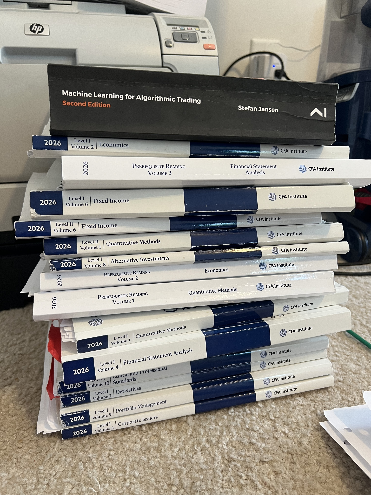

It’s Tuesday, August 25th, 2026 and I am about 4 days out from having taken the CFA L1 exam. It wasn’t terrible. I am writing this post both as a reflection of the exam, and also to sort of pre-register my experience. So if I pass, I will not do a disingenuous gloat-post about how I already knew I’d pass, with a bunch of phony, post-hoc reasons why I did (haha).

I am giggling a bit as I write this because, as I said in the voice note I sent to a friend in the test center parking lot, **I actually enjoyed taking the exam. I enjoyed it so much that I was giggling and smiling to myself while reading certain questions**. I know I was frustrating the proctor at one point, because on the overhead surveillance cameras I probably looked suspicious. The proctor kept walking by my desk and at one point, she paused from pacing and stood behind me to my right for a few seconds. I ignored her and continued smiling at the screen. 

### Exam perceptions

I thought the exam (my version of it, at least) was pretty straightforward, almost to the point of being easy. There was only one question (out of 180) where I didn’t recall seeing the related concept at all. (By my highlighter patterns, it was something I had read in the first few months of studying. I never made any notes for it or revisited it, though.) Otherwise, there were no surprises.

To me, the exam mirrored the official CFAI mock exams. The questions were very straightforward. The answer choices were likely to be tricks to catch you confusing one thing for another, but otherwise that was it. And I definitely fell for a few tricks. But, not very many.

Crucially, I didn’t leave any questions blank (even for questions where I drew a blank and could not come up with my own answer). There’s no penalty for wrong answers, so you have every incentive to answer every question—even if you just guess. With a lot of questions, you could intelligently eliminate at least one answer choice if you vaguely understood/remembered the concept. And the test software literally lets you mark off answer choices to make guessing easier.

I guessed on about 10-15 questions per session (there are two sessions), with slightly more guessing in the second session. The second session included more of the content I hadn’t reached. Now, why hadn’t I finished the entire curriculum? There’s a good reason.

While studying for the CFA exam, I studied for and passed two out of three levels of an entirely different financial-related charter program—the [Chartered Market Technician (CMT) program](https://cmtassociation.org/). This program is not as well known, but just as rigorous and intense, with hundreds of pages of deeply technical reading on markets and technical analysis per level (there are 3). This worked for a bit because there is some overlap in the content between the two exams. I was scheduled to take the third and final CMT exam in June/July, but deferred as it was running up against the CFA too much. (There is a reason I had all of this stuff overlapping that perhaps I will explain another time.)

I had a moment of frustration because there were definitely questions from content I didn’t reach (or hadn’t spent as much time on as others). And unfortunately, some of that content was from a more heavily-weighted topic on the exam. But, again, I tried to intelligently guess and move on. It was useless to try to spend any real time on those kind of questions as doing that stole time from questions I could answer. This was especially true if those questions involved any kind of calculation and needed to be completed more carefully and/or double-checked.

### A quick word on test prep

As for preparation, I did not use any of the test prep providers like Kaplan-Schweser or Mark Meldrum. I had already paid $1,140 to sign up for the exam itself, so I didn’t want to shell out another $1,000 for more study materials. I simply paid another $250 or so for a 13lb. box of the printed CFAI curriculum materials (nearly 4,000 pages), but that was it.

### Great expectations?

I also think I had a misconception of what to expect—which shaped how I studied and what content I emphasized. I was expecting to have to *do* certain things on the exam. I signed up for the CFA exam in the first place because I wanted to learn to *do* certain things and their curriculum looked like a clean, concise way to learn. I definitely learned from the readings and working on side projects during studying that solidified certain concepts beyond the textbook examples and beyond what I’d learned in business school. 

On the exam, though, with the topics I have in mind, there were just questions about the theory of the concept rather than explicitly making you do anything related to the concept. (If that sounds weird and vague, I am trying to avoid committing an ethical violation by divulging exam content.) I am hearing, however, that L2 should take care of the application I was expecting. NICE.

### And in sum...

Overall the CFA Level 1 exam is entirely doable and conquerable—even if CFAI statistics say most people fail (only 45% of the 24,000+ candidates from February 2026 passed). *And I say that without knowing my results at the moment*. If anything, how difficult you view the exam seems to be a product of how you studied, how much you studied, and most importantly, *what you retained* and can remember under exam conditions. Retention seems to slip a lot of people up. I certainly drew a blank on a few questions.

Reddit is not a representative sample of test takers, but there are so many posts there where people finished reading the entire curriculum but didn’t remember much of what they read. I was able to beat the forgetting curve by how I studied (happy to write another post later on those methods). So, **my issues came from not evenly reviewing everything and just simply not getting to everything—partly because I was studying for and passing a whole other exam**. The pattern of missing what I hadn’t read or properly reviewed showed up pretty strongly in my mocks. 

So, **if I do not pass, it will be because of uneven reviews and not finishing the curriculum**. Not because the L1 exam was hard. But to be fair, I totally understand why people experience it as being hard.

Either way, I got a ton out of studying for the exam in the first place. 
