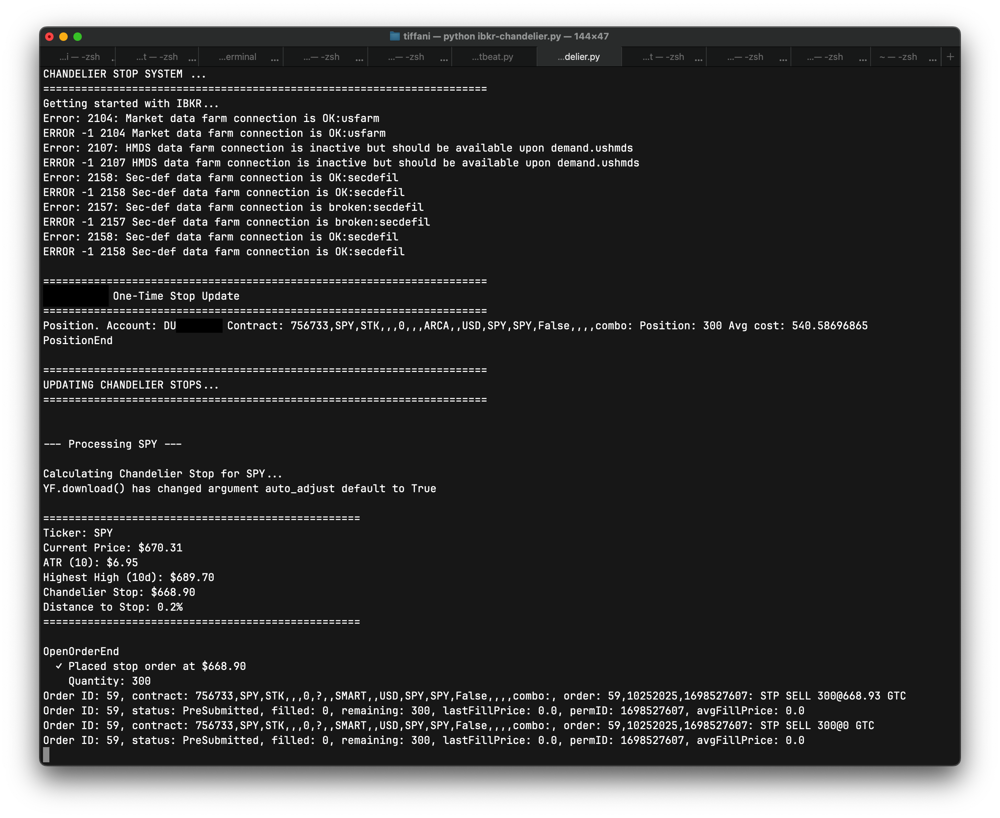

### "Cut your losses, let your gains run..." (just not *away*)

Having a better methodology for stops and capturing unrealized gains became super important after a certain set of recent disappointing trades. Goldman ran up to an all-time-high of $825.25 ahead of a Jerome Powell speech on September 22, 2025. The positions I held at that point were the result of a few days of analysis, familiarizing myself with more of the statistical properties of the things I am trading—especially in tandem with working through the Quantitative Methods book for the [CFA](https://www.cfainstitute.org) exam in February 2026. 


I did a five-year analysis of Goldman's daily returns dating back to January 2020. They showed 2.36 excess kurtosis and positive skew. In English, that is a stock that has small losses here and there, but a few very large gains. This was a very large gain...and yet I did not capture enough of this move.

I experienced a gain of 584.8% on a GS Oct 2026 800 call after GS rocketed to that all-time-high. Unfortunately, my stop did not hug this position tightly enough and in the subsequent drop gave back nearly half those gains. This was sad and preventable!


### What is a "chandelier stop"?

Interactive Brokers's Trader Workstation offers trailing stops. They are fixed, however. You can set a percentage or a fixed value for the stop. But, then you must through the rigamarole of determining what percentage or absolute value to use. And even after you do that, though, that's it. The parameter you set for how wide (permissive) or how narrow (restrictive) your trailing stop is doesn't change.

I have been wanting to understand if having a stop that adjusts dynamically based on an underlying's volatility made sense. And hey! It turns out this exists and it is called a **chandelier stop**. I first read about this in Dr. Alexander Elder's *Come Into My Trading Room*. **It uses the average true range of an underlying to turn volatility into a way to determine where stops should go.**

A chandelier stop is set with volatility in mind and may retreat as prices move around. This is basically the mechanical embodiment of *breathing room*. It can be used for both entries and exits.

As Elder says

> When traders are long, it hangs their stops from the highest peak reached by that trend, like a chandelier hangs from the tallest point in the room. As prices move up, the Chadelier Exit, suspended from the highest point of that trend, also rises. It tracks volatility as well as prices, as its distance from the peak grows with the rise in volatility. [...] There is no telling how high a trend may go, and a Chandelier will rise until prices peel off from the ceiling and hit that stop.

How much breathing room it has is, of course, the product of the parameters used to create the stop. The chandelier stop consists of a lookback period and the average true range (both to calculate volatility).


### Working with Interactive Brokers's API (v10.37+)

What's nice is that Interactive Brokers has an API and [Python](https://www.interactivebrokers.com/campus/ibkr-quant-news/interactive-brokers-python-api-native-a-step-by-step-guide/) libraries for programmatically interacting with your trading account. The APIs are extensive and take some effort to understand, though. (Some things are not documented very well, others are not documented at all unless you've joined a mailing list for support.) Once you get everything running, it is nothing to then start putting on and managing trades via Python—including creating a chandelier stop to manage a long call position that is in the green!

The code below uses Interactive Brokers's Python library `ibapi` version 10.37 to execute trades using IBGateway version 10.37 starting in October 2025.

This works, but is also still a work in progress.

```{.python filename="ibkr-chandelier.py"}
# Written to accommodate IBApi libraries 10.30 or above.
# Also built this using 10.37 version of IBGateway.

import os
import time
import datetime
import threading

import pandas as pd
import yfinance as yf

from ibapi.client import *
from ibapi.wrapper import *
from ibapi.contract import *
from ibapi.utils import iswrapper
from ibapi.ticktype import TickTypeEnum

from decimal import Decimal, ROUND_CEILING

ATR_MULTIPLIER = 3  # 3x ATR for stocks, 3-4x for options
ATR_PERIOD = 10 # Standard ATR period
LOOKBACK_PERIOD = 10 # Days to look back for highest high

# Need to round to next nickel to accommodate minimum order tick sizes
def round_to_nickel(price):
    return float((Decimal(str(price)) / Decimal('0.05')).quantize(Decimal('1'), rounding = ROUND_CEILING) * Decimal('0.05'))

class ChandelierStopManager:
    def __init__(self, ibkr_client, ibkr_account):
        self.ibkr_client = ibkr_client
        self.ibkr_account = ibkr_account

    def _cancel_existing_stops(self, ticker):
        # Cancel existing stop orders for a ticker
        open_orders = self.ib.openTrades()
        
        cancelled_count = 0
        for trade in open_orders:
            if (trade.contract.symbol == ticker and trade.order.orderType in ['STP', 'TRAIL']):
                self.ibkr_client.cancelOrder(trade.order)
                cancelled_count += 1
        
        if cancelled_count > 0:
            print(f"  Cancelled { cancelled_count } existing stop order(s) ...")


    # Calculate a chandelier stop for a given ticker
    def calculate_chandelier_stop(self, ticker, multiplier = ATR_MULTIPLIER, period = ATR_PERIOD):
        print(f"\nCalculating Chandelier Stop for { ticker }...")
        
        # Download recent price data
        data = yf.download(ticker, period = '2mo', interval = '1d', progress = False)
        
        if data.empty:
            print(f"Yikes: Could not download data for { ticker } ...")
            return None
        
        # Calculate True Range components
        high_low = (data['High'][ticker] - data['Low'][ticker])
        high_close = abs(data['High'][ticker] - data['Close'][ticker].shift())
        low_close = abs(data['Low'][ticker] - data['Close'][ticker].shift())
        
        # True Range = max of the three
        true_range = pd.concat([high_low, high_close, low_close], axis = 1).max(axis = 1)
        
        # Average True Range (ATR)
        atr = true_range.rolling(period).mean()
        current_atr = atr.iloc[-1]
        
        # Current price and highest high
        current_price = data['Close'][ticker].iloc[-1]
        highest_high = data['High'][ticker].tail(period).max()
        
        # Chandelier Stop = Highest High - (Multiplier * ATR)
        stop_level = round_to_nickel(highest_high - (multiplier * current_atr))
        
        # Calculate distance to stop as percentage
        distance_pct = ((current_price - stop_level) / current_price) * 100
        
        result = {
            'ticker': ticker,
            'current_price': current_price,
            'atr': current_atr,
            'highest_high': highest_high,
            'stop_level': stop_level,
            'distance_pct': distance_pct,
            'timestamp': datetime.datetime.now()
        }
        
        # Print results
        print(f"\n{ '=' * 50 }")
        print(f"Ticker: { ticker }")
        print(f"Current Price: ${ current_price:.2f}")
        print(f"ATR ({ period }): ${ current_atr:.2f}")
        print(f"Highest High ({ period }d): ${ highest_high:.2f}")
        print(f"Chandelier Stop: ${ stop_level:.2f}")
        print(f"Distance to Stop: { distance_pct:.1f}%")
        print(f"{ '=' * 50 }\n")
        
        return result
    
    # Calculate and update Chandelier stops for all open positions
    def update_stops_for_all_positions(self, multiplier = ATR_MULTIPLIER):
        if not self.ibkr_client.connected:
            print("Ooopps! You're not connected to IBKR...")
            return
            
        self.ibkr_client.reqPositions()

        time.sleep(10)

        positions = self.ibkr_client.positions
            
        if not positions:
            print("\nNo positions to update")
            return
            
        print(f"\n{ '=' * 70 }")
        print("UPDATING CHANDELIER STOPS...")
        print(f"{ '=' * 70 }\n")
            
        for position in positions:
            if position[1] > 0:  # Only for long positions
                ticker = position[0].symbol
                quantity = position[1]
                    
                print(f"\n--- Processing { ticker } ---")
                    
                # Calculate Chandelier stop level
                stop_data = self.calculate_chandelier_stop(ticker, multiplier)
                    
                if stop_data is None:
                    print(f"Skipping { ticker } - could not calculate stop ...")
                    continue
                    
                stop_level = stop_data['stop_level']
                    
                # Cancel any existing stop orders for this position
                self._cancel_existing_stops(ticker)
                    
                # Place new stop order
                self._place_stop_order(position[0], quantity, stop_level)

    def _cancel_existing_stops(self, ticker):
        # Cancel existing stop orders for a ticker
        self.ibkr_client.reqAllOpenOrders()

        time.sleep(10)
            
        cancelled_count = 0
        for trade in self.ibkr_client.open_orders:
            if (trade[1].symbol == ticker and trade[2].orderType in ['STP', 'TRAIL']):
                self.ibkr_client.cancelOrder(trade[0], OrderCancel())
                cancelled_count += 1
            
        if cancelled_count > 0:
            print(f"  Cancelled { cancelled_count } existing stop order(s) ...")

    def _place_stop_order(self, contract, quantity, stop_price):
        # Place a stop-loss order
        order = Order()
        order.action = 'SELL'
        order.orderType = 'STP'
        order.totalQuantity = quantity
        order.auxPrice = stop_price  # Stop trigger price
        order.account = self.ibkr_account
        order.tif = 'GTC'

        contract.exchange = 'SMART'
            
        oid = self.ibkr_client.nextId()

        # Place the order
        trade = self.ibkr_client.placeOrder(oid, contract, order)
            
        print(f"  ✓ Placed stop order at ${ stop_price:.2f}")
        print(f"    Quantity: { quantity }")
            
        return trade


# This is set up to serve as the client and the wrapper
class IBApiClient(EWrapper, EClient):
    IBKR_GATEWAY_ADDRESS = '127.0.0.1'
    IBKR_TESTING_PORT = 4002
    IBKR_LIVE_PORT = 4001

    LIVE_DATA = 1
    FROZEN_DATA = 2 
    DELAYED_DATA = 3
    FROZEN_DELAYED_DATA = 4

    def __init__(self, address, port, client_id):
        print("Getting started with IBKR...")
        EClient.__init__(self, self)
        EWrapper.__init__(self)
                
        # Establish the connection to TWS/IB Gateway
        # TWS supports up to 32 simultaneous client connections
        self.connect(address, port, client_id)
        self.connected = True
        self.positions = []
        self.open_orders = []

        # Launch the client thread
        # The 'run' function executes in a loop that repeats as long
        # as the client is connected.
        thread = threading.Thread(target = self.run)
        thread.start()

    @iswrapper
    def nextValidId(self, orderId):
        self.orderId = orderId

    @iswrapper
    def nextId(self):
        self.orderId += 1 
        return self.orderId
    
    @iswrapper
    def currentTime(self, current_time):
        t = datetime.datetime.fromtimestamp(current_time)
        print(f'Current time: { t }')

    @iswrapper
    def contractDetails(self, request_id, contractDetails):
        attrs = vars(contractDetails)
        print("\n".join(f"{ name }: { value }" for name, value in attrs.items()))

    @iswrapper
    def contractDetailsEnd(self, reqId):
        return super().contractDetailsEnd(reqId)

    @iswrapper
    def historicalData(self, request_id, bar):
        print(bar)
        return super().historicalData(request_id, bar)
    
    @iswrapper
    def historicalDataEnd(self, reqId, start, end):
        print(f"Historical data ended for { reqId }. Started at { start }, ending at { end }")
        return super().historicalDataEnd(reqId, start, end)

    @iswrapper
    def error(self, reqId, errorCode, errorString, advancedOrderRejectJson = ""):
        print(f'Error: { errorCode }: { errorString }')
        return super().error(reqId, errorCode, errorString, advancedOrderRejectJson)
    
    @iswrapper
    def tickPrice(self, reqId, tickType, price, attrib):
        print(f"Request ID: { reqId }, tickType: { TickTypeEnum.to_str(tickType) }, price: { price }, attrib: { attrib }")

    @iswrapper
    def tickSize(self, reqId, tickType, size):
        print(f"Request ID: { reqId }, tickType: { TickTypeEnum.to_str(tickType)}, size: { size }")

    @iswrapper
    def tickString(self, request_id, tickType, value):
        print(f"Request ID: { request_id }, tickType: { TickTypeEnum.to_str(tickType) }, value: { value }")

    @iswrapper
    def accountSummary(self, reqId, account, tag, value, currency):
        return super().accountSummary(reqId, account, tag, value, currency)
    
    @iswrapper
    def updatePortfolio(self, contract: Contract, position: float, marketPrice: float, marketValue: float, averageCost: float, unrealizedPNL: float, realizedPNL: float, accountName: str):
        print("UpdatePortfolio.", "Symbol:", contract.symbol, "SecType:", contract.secType, "Exchange:", contract.exchange, "Position:", position, "MarketPrice:", marketPrice, "MarketValue:", marketValue, "AverageCost:", averageCost, "UnrealizedPNL:", unrealizedPNL, "RealizedPNL:", realizedPNL, "AccountName:", accountName)
        
    @iswrapper
    def updateAccountTime(self, timeStamp: str):
        print("UpdateAccountTime. Time:", timeStamp)

    @iswrapper
    def updateAccountValue(self, key: str, val: str, currency: str, accountName: str):
        print("UpdateAccountValue. Key:", key, "Value:", val, "Currency:", currency, "AccountName:", accountName)

    @iswrapper
    def position(self, account: str, contract: Contract, position: Decimal, avgCost: float):
        self.positions.append([contract, position, avgCost])
        print("Position.", "Account:", account, "Contract:", contract, "Position:", position, "Avg cost:", avgCost)
        
    def positionEnd(self):
       print("PositionEnd")

    def orderStatus(self, orderId: OrderId, status: str, filled: Decimal, remaining: Decimal, avgFillPrice: float, permId: int, parentId: int, lastFillPrice: float, clientId: int, whyHeld: str, mktCapPrice: float):
        print("OrderStatus. Id:", orderId, "Status:", status, "Filled:", decimalMaxString(filled), "Remaining:", decimalMaxString(remaining), "AvgFillPrice:", floatMaxString(avgFillPrice), "PermId:", intMaxString(permId), "ParentId:", intMaxString(parentId), "LastFillPrice:", floatMaxString(lastFillPrice), "ClientId:", intMaxString(clientId), "WhyHeld:", whyHeld, "MktCapPrice:", floatMaxString(mktCapPrice))

    def openOrderEnd(self):
        print("OpenOrderEnd")


    @iswrapper
    def get_positions(self):
        # Get all current positions from an account
        if not self.connected:
            print("Error: You're not connected to IBKR ...")
            return []
        
        positions = self.positions()
        print(f"\nFound { len(positions) } open positions")
        
        for pos in positions:
            print(f"  • {pos.contract.symbol}: { pos.position} contracts @ ${ pos.avgCost:.2f}")
        
        return positions

    # Order-related wrappers
    @iswrapper
    def openOrder(self, orderId, contract, order, orderState):
        self.open_orders.append([orderId, contract, order, orderState])

        print(f"Order ID: { orderId}, contract: { contract }, order: { order }")
        return super().openOrder(orderId, contract, order, orderState)
    
    @iswrapper
    def orderStatus(self, orderId, status, filled, remaining, avgFillPrice, permId, parentId, lastFillPrice, clientId, whyHeld, mktCapPrice):
        print(f"Order ID: { orderId }, status: { status }, filled: { filled }, remaining: { remaining }, lastFillPrice: { lastFillPrice }, permID: { permId }, avgFillPrice: { avgFillPrice }")
        return super().orderStatus(orderId, status, filled, remaining, avgFillPrice, permId, parentId, lastFillPrice, clientId, whyHeld, mktCapPrice)
    
    @iswrapper
    def execDetails(self, reqId, contract, execution):
        print(f"Execution details. Request ID: { reqId }, contract: { contract }, execution: { execution }")
        return super().execDetails(reqId, contract, execution)

def update_once(ibkr_client):
    # Example: Connect to IBKR and update stops once
    print("\n" + "=" * 70)
    print("One-Time Stop Update")
    print("=" * 70)
    
    try:
        ibkr_account = os.getenv("IBKR_ACCOUNT_ID") 
        manager = ChandelierStopManager(ibkr_client = ibkr_client, ibkr_account = ibkr_account)
        manager.update_stops_for_all_positions(multiplier = ATR_MULTIPLIER)
    except KeyError:
        print("Yikes! No IBKR account ID available...")

if __name__ == "__main__":
    print("\n" + "=" * 70)
    print("CHANDELIER STOP SYSTEM ...")
    print("=" * 70)

    # Connect to Interactive Brokers API via IB Gateway (v10.37 in this case...)
    ib_client = IBApiClient(IBApiClient.IBKR_GATEWAY_ADDRESS, IBApiClient.IBKR_TESTING_PORT, 10252025)
    
    time.sleep(7)

    update_once(ib_client)
    
```

And when it runs, this is what you get! This run is based on my paper trading account with an existing `SPY` position (shares, not options) I bought when it was at $540.59-ish.



### What's next?

Elder himself admits that the "...negative side of Chandelier Exits is that they give up a great deal of profit. Three Average True Ranges can amount to a lot of money in a volatile market." He recommends experimenting with the Average True Range coefficient (`ATR_MULTIPLIER` in my code).

The code listed here does not include the portion that takes a volatility and calculates the option price to set a stop. I will update with that soon.

Finally, some of this code could be cleaned up. The Interactive Brokers API callback methods are mostly from their developer documentation.

### An update

Funny enough, this stop triggered right at opening on November 7 after a bad Michigan consumer sentiment reading and tech stock sell-offs. `SPY` slid to a low of $661.21 after this triggered. There probably could be some work around giving these stops a bit more breathing room (`SPY` only had to move 0.2% to the downside to trigger it which could easily come from opening volatility some days), but this was still great to see it activate and see `SPY` continue to fall after this stop was activated, preserving (paper) funds. That really illustrates the power of stops (ignoring stop hunters and quick bouncebacks which could be dealt with by more breating room, etc.).

